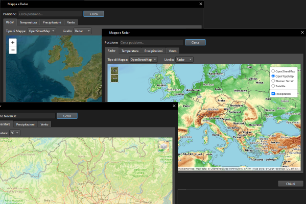

# 🌦️ Weather App

A modern, feature-rich Python weather application (v1.6.0) with a beautiful, responsive GUI built using PyQt6. Get real-time weather conditions, forecasts, alerts, and interactive weather maps for any location worldwide. The app supports multiple weather providers, languages, and units, making it a versatile tool for users everywhere.

[](https://www.gnu.org/licenses/gpl-3.0)
[](https://www.python.org/downloads/)
[](https://github.com/psf/black)
[](https://discord.gg/ryqNeuRYjD)


## 🚀 What's New in v1.6.0

- **New Features**
  - Interactive Weather Maps & Radar
  - Real-time radar data visualization
  - Multiple map layers (radar, satellite, terrain)
  - Weather overlays for temperature, precipitation, and wind
  - Location search with geocoding
  - Caching of map data for better performance
  - Support for multiple map providers (OpenStreetMap, OpenTopoMap, Stamen)
  - Enhanced notification system with system tray integration
  - Support for different alert types (info, warning, error, critical)
  - Persistent notification history
  - Mute notifications option
  - Automatic cleanup of expired alerts
  - Weather alerts for severe conditions
  - Heavy precipitation warnings
  - High wind alerts
  - Extreme temperature warnings
  - Nighttime travel advisories

- **New Language System**
  - Completely redesigned translation system with JSON-based files
  - Support for 16 languages:
    - English
    - Italian
    - Spanish
    - French
    - German
    - Russian
    - Arabic
    - Japanese
    - Korean
    - Dutch
    - Polish
    - Portuguese
    - Hebrew
    - Hungarian
    - Chinese
    - Turkish
  - Dynamic language switching without app restart
  - Improved RTL language support for Arabic and Hebrew
  - Fallback to English for missing translations
  - Optimized translation loading with memory caching

- **Enhanced User Interface**
  - Redesigned language selector in settings
  - Improved text rendering for all supported languages
  - Better handling of special characters and RTL text
  - Consistent terminology across all translations

## 🚀 What's New in v1.5.0

- **Improved Reliability**
  - Optimized API request batching
  - Enhanced error handling and recovery
  - Fixed timezone handling and race conditions

- **Better User Experience**
  - Multi-language support for all UI elements
  - Improved high-DPI display support
  - Enhanced logging with file rotation
  - Memory optimizations for better performance

## ✨ Features



- **Interactive Maps**: View real-time weather maps with radar, satellite, temperature, precipitation, and wind data
- **Location Search**: Find any location with the built-in geocoding powered by Nominatim
- **Multiple Map Types**: Switch between different map styles including OpenStreetMap, OpenTopoMap, and Stamen Terrain
- **Weather Data**: Powered by Open-Meteo
  - Reliable and free weather data
  - No API key required
  - Global coverage with high accuracy
  
- **Comprehensive Weather Data**
  - Current conditions with detailed metrics
  - 7-day forecast with daily and hourly breakdowns
  - Weather alerts and warnings
  - Enhanced history with detailed weather metrics
  - Markdown documentation viewer

- **User Experience**
  - Clean, modern UI with dark themes
  - Support for multiple languages
  - Customizable units (metric/imperal)
  - Favorite locations with quick access
  - Responsive design for different screen sizes

- **For Developers**
  - Well-documented codebase
  - Comprehensive test suite
  - RESTful API for integration
  - Docker support for easy deployment

## 🚀 Quick Start

### Prerequisites

- Python 3.10 or higher
- Git
- pip (Python package manager)

### Installation

1. **Clone the repository**
   
   ```bash
   git clone https://github.com/Nsfr750/weather.git
   cd weather
   ```

2. **Set up a virtual environment (recommended)**

   Windows:
   ```bash
   python -m venv venv
   .\venv\Scripts\activate
   ```
   
   Linux/macOS:
   ```bash
   python3 -m venv venv
   source venv/bin/activate
   ```

3. **Install the required dependencies**
   
   ```bash
   pip install -r requirements.txt
   ```

4. **Set up OpenWeatherMap API Key (Required for Weather Maps)**

   The weather maps feature requires an API key from OpenWeatherMap. You can get a free API key by signing up at [OpenWeatherMap](https://openweathermap.org/api). The free tier includes 1,000,000 calls/month which is more than enough for personal use.

   After obtaining your API key, run the setup script:

   ```bash
   python script/setup_owm_api.py
   ```

   Follow the prompts to enter your API key. The key will be securely stored in the application's configuration.

5. **Install additional dependencies for weather maps (optional)**
   
   The weather maps feature requires these additional packages:
   
   ```bash
   pip install folium PyQtWebEngine geopy
   ```
   
   - `folium`: For creating interactive maps
   - `PyQtWebEngine`: For displaying web content in the PyQt6 application
   - `geopy`: For geocoding location names to coordinates

4. **Run the application**

   ```bash
   python -m script.main
   ```

### Configuration

1. Launch the application
2. Search for your location to get started
3. No API key required - uses Open-Meteo by default

## 📚 Documentation

For detailed documentation, please check the `/docs` directory in the repository.

- [User Guide](docs/usage.md)
- [Configuration](docs/configuration.md)
- [Developer Guide](docs/development.md)
- [API Reference](docs/api.md)
- [Troubleshooting](docs/troubleshooting.md)

## 🤝 Contributing

We welcome contributions! Please read our [Contributing Guidelines](CONTRIBUTING.md) for details on how to submit pull requests, report bugs, or suggest new features.

1. Fork the repository
2. Create your feature branch (`git checkout -b feature/AmazingFeature`)
3. Commit your changes (`git commit -m 'Add some AmazingFeature'`)
4. Push to the branch (`git push origin feature/AmazingFeature`)
5. Open a Pull Request

## 📄 License

This project is licensed under the GPL-3.0 License - see the [LICENSE](LICENSE) file for details.

## 🙏 Acknowledgments

- All the amazing weather data providers
- The PyQt community for the excellent GUI framework
- All contributors who have helped improve this project

## 📞 Support

For support, please join our [Discord server](https://discord.gg/ryqNeuRYjD) or open an issue on GitHub.

---

<div align="center">
  Made with ❤️ by <a href="https://github.com/Nsfr750">Nsfr750</a>
  <br>
  <a href="https://www.paypal.me/3dmega">
    
  </a>
  <a href="https://www.patreon.com/Nsfr750">
    
  </a>
</div>
